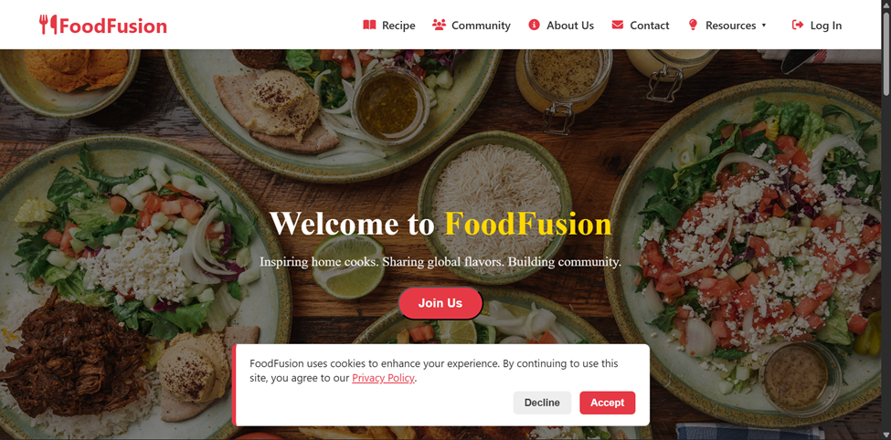
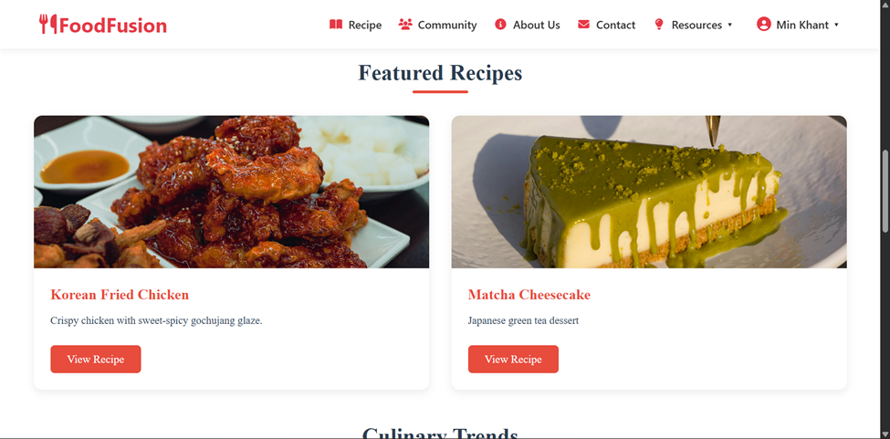
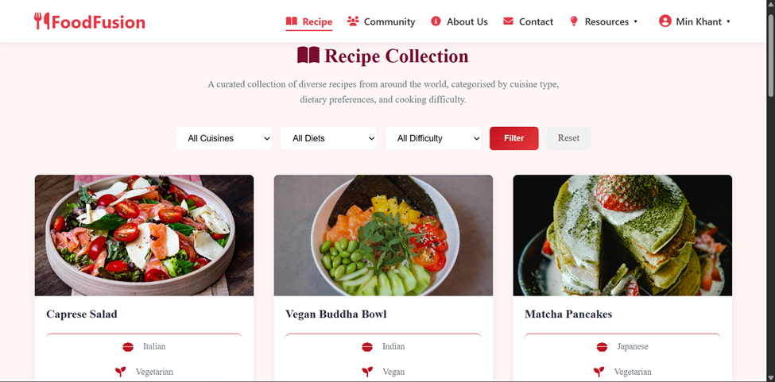
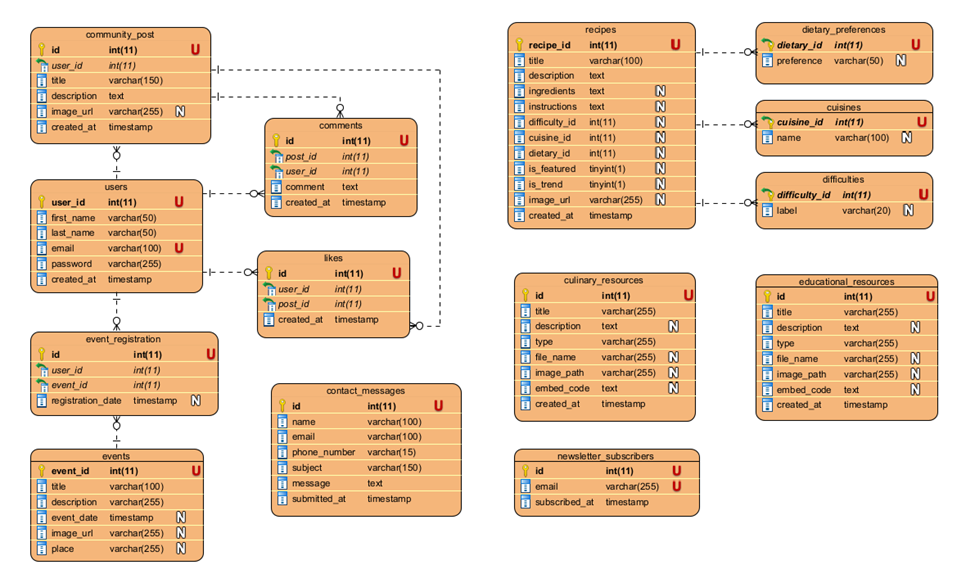

# FoodFusion

Recipe Sharing & Food Community Platform

NCC Level 5 Diploma in Computing — Back End Web Development Assignment

---

## Overview

FoodFusion is a server-side rendered web application that serves as a recipe collection and food community platform. Users can browse recipes, register accounts, share cooking posts, like and comment on community content, register for events, and access culinary and educational resources.

---

## Screenshots

<table>
  <tr>
    <td></td>
    <td></td>
  </tr>
  <tr>
    <td></td>
    <td></td>
  </tr>
</table>

---

## Features

### Public Pages
- **Homepage** — Featured recipes, culinary trends, upcoming events carousel, mission section, cookie consent
- **Recipe Collection** — Filterable grid by cuisine, dietary preference, and difficulty
- **View Recipe** — Full recipe details with ingredients, instructions, and labels
- **About Us** — Mission, values, team profiles
- **Contact Us** — Contact form with phone number validation
- **Culinary Resources** — Downloadable recipe cards (PDF) and cooking tutorials
- **Educational Resources** — Educational PDFs, infographics, and video carousel
- **Community Cookbook** — Browse user-submitted posts with like and comment counts
- **FAQ**, **Privacy Policy**, **Terms of Service** — Static informational pages

### User Authentication
- **Register** — Account creation with strong password validation and email uniqueness check
- **Login** — Session-based authentication with brute-force lockout (3 failed attempts = 3-minute lockout)
- **Logout** — Session destruction with confirmation
- **Edit Profile** — Update first and last name
- **Change Password** — Old password verification with strength validation

### Community & Social
- **Share Posts** — Authenticated users can submit posts with title, description, and image upload
- **Like System** — Toggle like/unlike on community posts via AJAX
- **Comment System** — Authenticated users can comment on posts (reverse chronological order)
- **Event Registration** — Register for upcoming cooking events

### Utility
- **Newsletter Subscription** — Email signup form
- **File Downloads** — Secure PDF and image serving
- **Cookie Consent** — Client-side banner with accept/decline

---

## Tech Stack

| Component    | Technology                    |
|--------------|-------------------------------|
| Backend      | PHP (native, procedural)      |
| Database     | MySQL via PDO                 |
| Frontend     | HTML5, CSS3, Vanilla JavaScript |
| Icons        | Font Awesome 6.5.0 (CDN)      |

---

## Prerequisites

- PHP 7.4 or higher (with PDO MySQL extension enabled)
- MySQL server
- A Apache web server

---

## Installation

### 1. Clone the Repository

```bash
git clone https://github.com/MinKhantt/food-fusion.git
cd food-fusion
```

### 2. Set Up the Database

import `food_fusion.sql` file to MySQL Workbench

### Entity-Relationship Diagram



### 3. Configure Database Connection

Edit `include/db_config.php` to match your MySQL settings if needed (default: host `localhost:3307`, user `root`, no password).

---

## Security Features

- **SQL Injection Prevention** — All database queries use PDO prepared statements with parameterised queries
- **XSS Prevention** — User output is escaped with `htmlspecialchars()`
- **Password Security** — Passwords hashed using `password_hash()` (bcrypt) and verified with `password_verify()`
- **Brute-Force Protection** — Login lockout after 3 failed attempts (3-minute cooldown with countdown timer)
- **Input Validation** — Server-side validation for email format, phone numbers, and password strength
- **File Upload Safety** — Community post image uploads restricted to validated image types
- **Download Security** — File paths sanitised using `basename()` to prevent directory traversal
